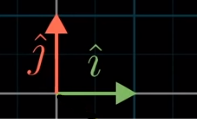

# Linear Algebra & Its Visualisations (3B1B)

### Chapter 02: Linear Combinations, Span & Basis Vectors

<!--UL-->
* In the XY-coordinate systems, there are two very special vectors:

<!-- Blockquote -->
<!--UL -->
> * The one pointing to the right with length 1, commonly called “i-hat” or the unit vector in the x-direction.
> * The one pointing straight up with length 1, commonly called “j-hat” or the unit vector in the y-direction.

* _i_-hat and _j_-hat are called the "**basis vectors**" of the standard coordinate system.

* So, each vector in the XY-coordinate system can be obtained as a sum of two vectors obtained by the scaling (stretching/squishing/flipping) of the basis vectors of the XY system. This is called "**linear combination**" of the two vectors.

* Intuition: When we fix one of the two scalars and let the other vary, the tip of the resultant vector obtained traces a straight-line path, hence “linear” combination of vectors.

* The span of two vectors v and w is the set of all their possible linear combinations.

* When the two vectors do not occur along the same line, each of them individually adds a dimension to the resultant vector, resulting in a 2D vector whose span is the entire 2D plane.

* However, when they line up, the span is all the vectors whose tip sits on a certain line. And when both scalars are zero in this case, we end up reaching the origin.

* When each vector adds a different dimension to our span, they are “**linearly independent**”.

* When at least one of the vectors is redundant (does not add anything to our span; two vectors lining up) the vectors are said to be “**linearly dependent**”, where one of the vectors can be expressed as a linear combination of the others.

* Technical Definition of Basis Vectors: The basis of a vector space is a set of linearly independent vectors that span the full space.

